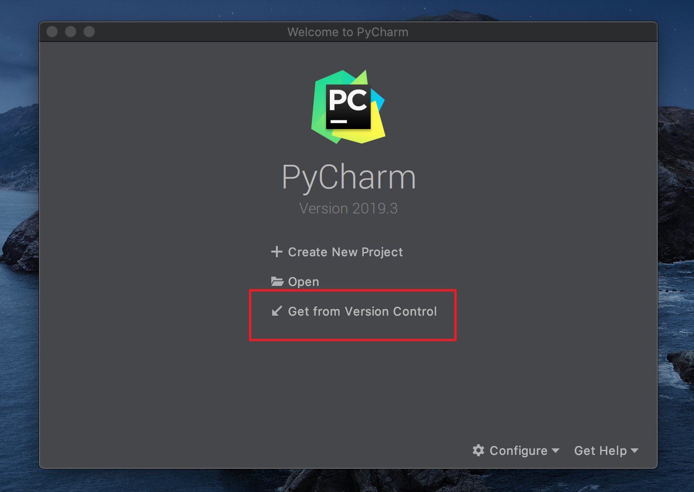
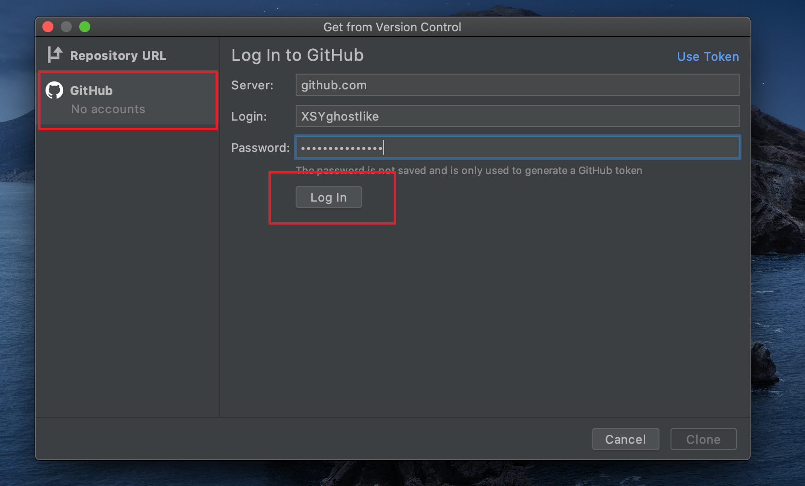
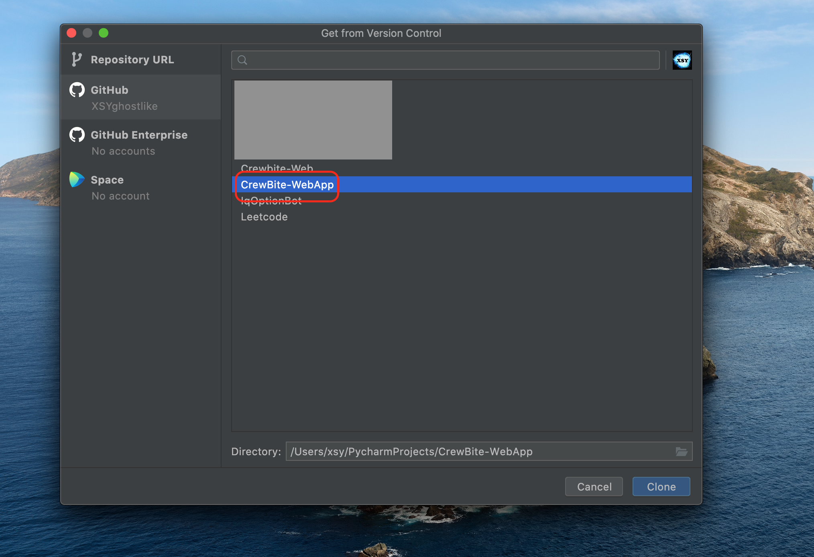
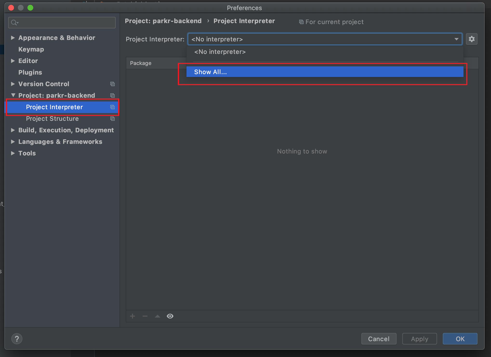
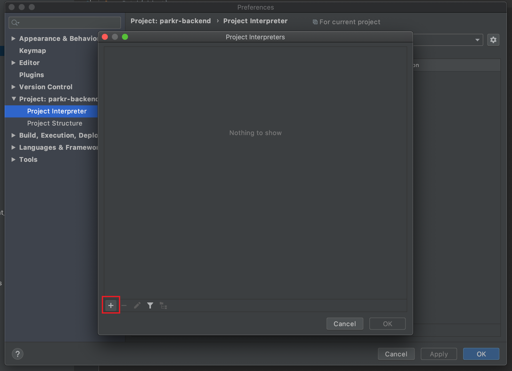
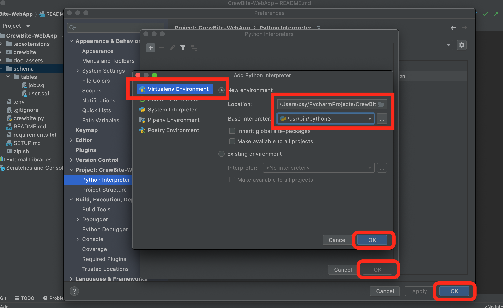
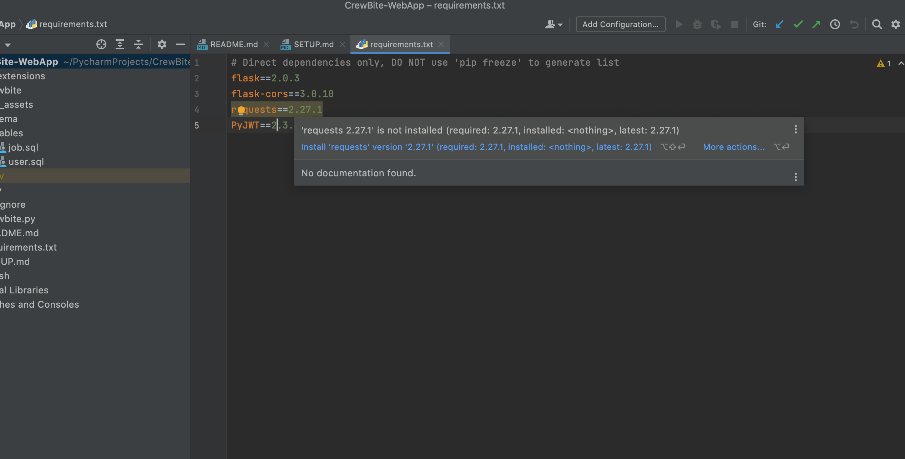
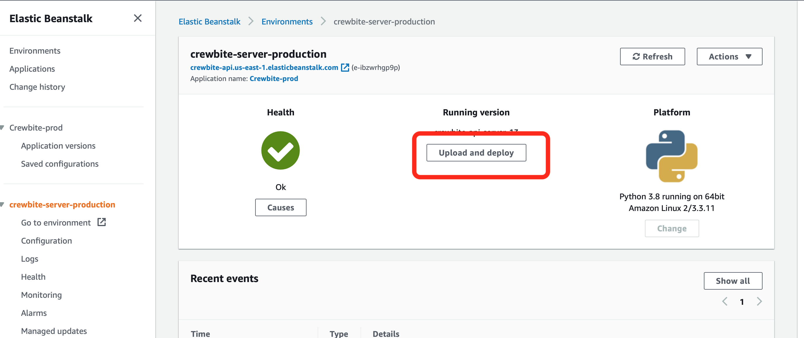

# Crewbite - Project Initialization, Testing & Deployment
This installation guide covers the setup & deployment process of 
* Production environment (Elastic Beanstalk)
* Local testing environment (Localhost)

> The following operating systems were tested:
> * Mac OS X (10.15.7)
> * Windows 11 Pro (Build 21H2)
> * Linux (Ubuntu 18.04)


### Tools
- [Git](https://git-scm.com/downloads) (For Windows please install Git Bash as well, it is included in Git installer)
- [Python3](https://www.python.org/downloads/) 
- [PyCharm](https://www.jetbrains.com/pycharm/download/)
- [7zip](https://www.7-zip.org/download.html) (For Windows only, add 7z executable to $PATH)
### Permissions
* Please ask Jasmin for AWS, Stripe access credentials

## Setup
### 1. Clone project to local repository



### 2. Setup Python virtual environment
* Windows: File &rarr; Settings
* Mac & Linux: PyCharm &rarr; Preferences


Select the Python3 Interpreter you just installed. (DONT use default interpreter from Mac or Linux)

After the virtual environment is setup, Pycharm will prompt to install required modules specified by **requirements.txt**, Click **Install Requirements** or use the following command:
```bash
pip install -r requirements.txt 
```


## Deploy our Application
### Local testing environment
* Within the virtual environment, load environment variables.
```bash
source .env
```
* Within the virtual environment, start flask server.
```bash
python application.py
```
* To verify if API is running access `http://localhost:5000/this-is-a-public-api` on browser, the result need to be:
```
{
  "owner_email": "wanzhenglyu@crewbite.com"
}
```
### Production environment
* zip the source code
```bash
bash zip.sh
```
* Upload the **crewbite.zip** file to Elastic Beanstalk (CrewbiteAPI-prod)

* To verify if API is running access `https://api.crewbite.io/this-is-a-public-api` on browser, the result need to be:
```
{
  "owner_email": "wanzhenglyu@crewbite.com"
}
```

## Database initialization
If you just switched to a new database without any tables in it, use the following command to re-create all the tables.
```
cd /schema/tables
mysql -u[username] --host=[hostname] --protocol=tcp -p crewbite-mysql < create_tables.sql
```